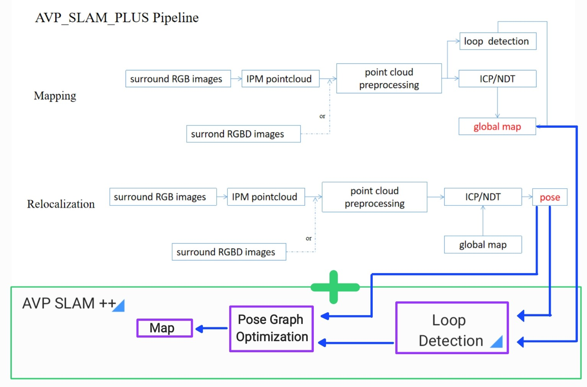
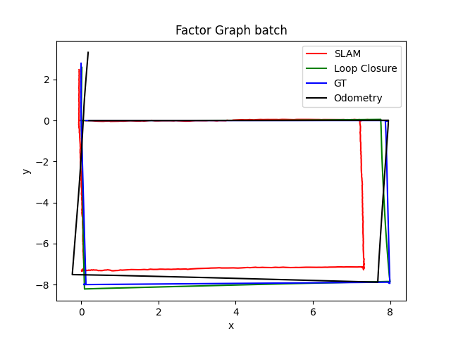

# AVP-SLAM+++
**Authors**: [Vivek Jaiswal](mailto:vjaiswal@umich.edu), [Harsh Jhaveri](mailto:hjhaveri@umich.edu), [Chun-Hsueh Lee](mailto:chunhlee@umich.edu), [Devin McCulley](mailto:devmccu@umich.edu)
AVP-SLAM++ is an extension on the AVP-SLAM-PLUS repository initially implemented by [Liu Guitao](mailto:liuguitao@sia.cn). 
We fork previous forked repos to our AVP-SLAM+++ and make some changes to the original code of AVP-SLAM++, and many thanks to [rob530-w22-team25](https://github.com/rob530-w22-team25/AVP-SLAM-PLUS).

## AVP-SLAM-PLUS Overview
AVP-SLAM-PLUS is an implementation of [AVP-SLAM: Semantic Visual Mapping and Localization for Autonomous Vehicles in the Parking Lot (IROS 2020)](https://arxiv.org/abs/2007.01813) with some new contributions including:
* The addition of a multi-RGBD camera mode. AVP-SLAM was initially only implmented with multiple RGB cameras
* The addition of using normal distribution transformation (NDT) for localization. As published, AVP-SLAM uses iterative closest point (ICP).

Performance of AVP-SLAM-PLUS could be found in video(https://www.bilibili.com/video/BV11R4y137xb/).

<p align='center'>


<h5 align="center">mapping</h5>
</p>

<p align='center'>


<h5 align="center">localization</h5>
</p>
                  
The AVP-SLAM-PLUS code is simple and developed to be a good demonstrative example for SLAM beginners. The framework of the original structure of AVP-SLAM-PLUS is as follows:

<p align='center'>

<h5 align="center">AVP-SLAM-PLUS Framework</h5>
</p>

## AVP-SLAM++ Overview
During initial testing, AVP-SLAM-PLUS produced a trajectory with inconsistent scaling and frames between Gazebo and RViz. Additionally, the performance of SLAM using the multi-RGBD mode was failure prone. While AVP-SLAM-PLUS consistently found a solution when run in multi-RGB mode, the trajectory resulting from SLAM tracked well initially, but was "scaled down" as time went on and was also not smooth overall. AVP-SLAM++ works to solve these problems with the following steps.
- Implementing an odometry controller to produce simulated transformations between each subsequent pose
- Extracting multi-RGB mode AVP-SLAM-PLUS poses
- Optimizing the resulting trajectory using GraphSLAM, both using a batch solution and also ISAM2. 
  - AVP-SLAM-PLUS poses were used as verticies
  - Odometry transformations were used as edges
  - Loop closures were found using the distance between two AVP-SLAM-PLUS poses. These poses are already localized using either ICP or NDT, and thus, loop closure is found if two poses are within a threshold distance of each other. In order to not produce loop closure constraints between neighboring (or truly close points), 300 neighboring poses were ignored for this comparison. 300 was found using tuning

## Framework
<p align='center'>

<h5 align="center">AVP-SLAM++ Framework</h5>
</p>

## Folder Structure
    .
    ├── GraphSLAM                         # Python script to parse rosbag and generate graph
    ├── avp_slam_plus                     # source code
    │   ├── config
    │   ├── data
    │   ├── include
    │   ├── launch
    │   ├── model
    │   ├── scripts
    │   └── src
    ├── controller                        # Script to automate trajectory generation in Gazebo
    ├── convert_orientation               # utility scripts for angle conversions
    ├── images
    ├── pdf				  # PDF file for detailed experimental results and methodology
    ├── parse_rosbag                      # record a rosbag, find loop closures, optimize, and view results
    ├── simulate_gazebo                   # source code creating simulation and manual robot control
    └── README.md
## 1. Prerequisites
### 1.1 Operating System Basics
Ubuntu 64-bit. The version of your kernel (18.04, 20.04, etc.) does not matter as long as it supports `docker`.

### 1.2 Clone Repository and Docker Setup
Running this environment locally on an Ubuntu system may lead to issues. We have provided a [docker image and shell script](https://drive.google.com/drive/folders/1uGGLLqDvklrvQkxCCnYLfekTPiSUEarH?usp=sharing) for convenience.

In order to proceed with setup, you must have docker installed on your local system. For Ubuntu 20.04, follow Step 1 and 2 [here](https://www.digitalocean.com/community/tutorials/how-to-install-and-use-docker-on-ubuntu-20-04#step-3-using-the-docker-command).

Once you have downloaded the docker image, navigate to the directory where this is stored and load the image onto your system.
```
    cd ~/path/to/docker/image
    docker load --input avp-slam.tar
```

Clone the AVP-SLAM++ repository to you local system. This does not need to be in the same location as `avp-slam.tar`, as this repository will be used often
```
    git clone https://github.com/rob530-w22-team25/AVP-SLAM-PLUS.git
```

Edit the shell script to utilize the path to your AVP-SLAM repository, save it, and run your docker image with the following command. By linking your local AVP-SLAM repository to your docker image, you will be able to make changes locally and also run the most up-to-date code in the docker image.
```
    cd ~/path/to/shell/script
    ./avp-slam.sh
```

Whenever you have updated your docker environment, and would like to save, use the `docker commit command`. While the edited docker image is running, execute
```
    docker ps
```
and copy the value of the `NAMES` field of the image that you are currently running. Then execute the `commit` command with the following:
```
    docker commit NAME_FROM_PS_COMMAND avp-slam
```
You will receive a `SHA256` line as output to confirm the completion of the command. This will now allow you to utilize the latest version of your docker image the next time you run it with the provided shell script. Failure to do this after you have made changes will force you to enact your changes all over again. If you have gotten to this point in the docker setup, commit your progress to your docker image at least once to ensure models too do not need to be loaded again.

### 1.3 **Load Gazebo Model** 
Inside your docker image, run the following commands to load the models necessary for use in Gazebo.

```
    cd /home/catkin_ws/AVP-SLAM-PLUS/avp_slam_plus/model/
    unzip my_ground_plane.zip -d ~/.gazebo/models/
```
Depending on how you have configured your docker paths, the first path may be slightly different. Regardless, navigate to the `models/` folder inside of AVP-SLAM-PLUS and then run the `unzip` command. 

## 2. Build AVP-SLAM-PLUS
```
    cd /home/catkin_ws
    catkin_make
    source /home/catkin_ws/devel/setup.bash
```

## 3. RUN Example
                  
### 3.1 **save map**

If you want to save map and use the map to do localization, you should ensure your config file have be correctely set. The config file is at   **AVP-SLAM-PLUS/avp_slam_plus/configFile.yaml**

```
    mapSave: true
    mapSaveLocation: your map file address 
```    
### 3.2  **Launching AVP-SLAM-PLUS**            
First choose a camera mode and launch the environment with one of the following options.

#### 3.2.1  **RGB Mode**
SLAM
```
    roslaunch avp_slam_plus slamRGB.launch
```
Localization

If you previously ran SLAM and "save map", you can do localization in the prior map.
```
    roslaunch avp_slam_plus localizationRGB.launch
```


#### 3.2.2  **RGBD Mode**                                                
SLAM
```
    roslaunch avp_slam_plus slamRGBD.launch
```
Localization
                                         
If you previously ran SLAM and "save map", you can do localization in the prior map.
```
    roslaunch avp_slam_plus localizationRGBD.launch
```

### 3.3 **Pose Graph Optimization**
Open a new terminl and follow these steps if you wish to **optimize the trajectory offline**.

You should run all the .sh file under **/catkin_ws**

#### 3.3.1 **Recording Rosbag**
```
    rosrun parse_rosbag record_rosbag.sh                                         
```                                         
Once the rosbag is recording move the robot using a method from Robot Control and when that is done use Ctr+C on the rosbag recording.

If you firstly record rosbag, you should ensure **record_rosbag.sh** in **AVP-SLAM-PLUS/parse_rosbag/launch/** to be executable. You can do this command to let **record_rosbag.sh** to be executable.		

```
    chmod +777 record_rosbag.sh
``` 
										 
#### 3.3.2 **Loop Closure Detection and Graph Optimization**
The following script requires a rosbag name located in AVP-SLAM-PLUS/parse_rosbag/data/rosbag/. This is the default when recording rosbags so all you need to change is the "fileName" in AVP-SLAM-PLUS/parse_rosbag/config/configFile.yaml. Leave out the .bag in your file name.
```
    rosrun parse_rosbag parse_plot.sh
```                                         
In the output of this script you will see a print statement indicating how many loop closures were detected. It will also print the total number of vertexes and edges in your pose graph. A graph will show the following trajectories: AVP-SLAM-PLUS, optimized pose graph, ground truth, and odometry. Finally it will print the root mean squared error for each trajectory.

If it is the first time you run `parse_plot.sh`, you should ensure `parse_plot.sh` in `AVP-SLAM-PLUS/parse_rosbag/launch/` to be executable. You can do this command to let **parse_plot.sh** to be executable.		

```
    chmod +777 parse_plot.sh
``` 

After running `rosrun parse_rosbag parse_plot.sh`, you should see result similar to these figures.

<p align='center'>


<h5 align="center">Graph Optimization</h5>
</p>

### 3.4 **Robot Control**
Choose one of the following options to move the robot in the simulation once you have launched AVP-SLAM-PLUS.
                                         
#### 3.4.1 **Manual Control**
Open a new terminal and control robot movement using keyboard input following the instructions printed in the terminal.
```
    roslaunch robot_control robot_control.launch
```
If you firstly control robot movement, you should ensure `robot_control.py` in `AVP-SLAM-PLUS/simlate_gazebo/robot_control/` to be executable. You can do this command to let `robot_control.py` to be executable.
```
    chmod +777 robot_control.py
```    
                                         
#### 3.4.2 **Sequence of Commands**
Perform a list of command inputs specified in the python script. Each input has an x velocity, rotational velocity, and time spend performing this command.                                        
```
    rosrun robot_control robot_path.py
```

For the first time running `rosrun robot_control robot_path.py`, you should ensure `robot_path.py` in `AVP-SLAM-PLUS/simlate_gazebo/robot_control/` to be executable. You can do this command to let `robot_path.py` to be executable.
```
    chmod +777 robot_path.py
```

#### 3.4.3 **Path Following Controller**
Command the robot to drive towards certain positions on the map. This is a globally aware controller that uses ground truth to ensure the robot follows the exact path set in `AVP-SLAM-PLUS/controller/config/configFile.yaml`.
```
    roslaunch controller controller.launch                                     
```
For the first time running `roslaunch controller controller.launch`, you should ensure `odom_controller.py` in `AVP-SLAM-PLUS/controller/scripts/` to be executable. You can do this command to let `odom_controller.py` to be executable.
```
    chmod +777 odom_controller.py
```

## 4. Detailed Methodology and Experimental Results
For more details on how the project was implemented, see [here](https://github.com/rob530-w22-team25/AVP-SLAM-PLUS/blob/main/pdf/AVP_SLAM_PLUSPLUS_ROB530_FinalPaper_Team25.pdf). 
                                         
## 5. Acknowledgements
We'd like to thank the original AVP-SLAM team, Tong Qin, Tongqing Chen, Yilun Chen, and Qing Su. Additionally, we would also like to acknowledge the precusory work done by [TurtleZhong](https://github.com/TurtleZhong/AVP-SLAM-SIM) who first developed an initial simulation environment for AVP-SLAM and by [huchunxu](https://github.com/huchunxu/ros_exploring) who developed an intutive simulated robot model. Addtionally, a big thanks to [Liu Guitao](mailto:liuguitao@sia.cn) who originally developed AVP-SLAM-PLUS. The original implementation of AVP-SLAM-PLUS can be found [here](https://github.com/liuguitao/AVP-SLAM-PLUS).

Additionally, we would like to acknowledge and give a big thanks to the W22 instructional team of [NAVARCH 568/ROB 530 Mobile Robotics](https://robots.engin.umich.edu/mobilerobotics/) for their teaching and continual support throughout this entire process. We appreciated the effort and the learning opportunity.
